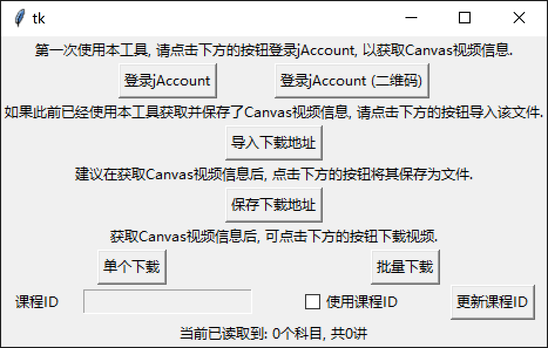
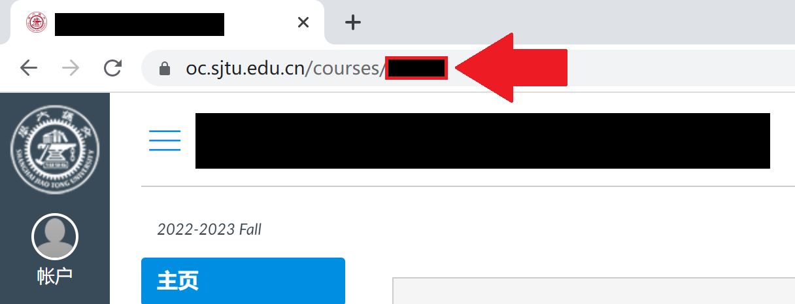

## SJTU Canvas 视频 (批量) 下载器

本项目使用GitHub Actions自动发布, 保证可执行文件的安全性.

### 主界面展示



### 使用说明

课程ID:



### 非Windows用户使用方法

目前只能使用源代码运行. 以Ubuntu 20.04为例. 请安装`python3`, `python3-pip`.

```sh
sudo apt install python3
sudo apt install python3-pip
```

安装`requirements.txt`中的软件包.

```sh
sudo pip3 install -r requirements.txt
```

需要安装`python3-tk`, `python3-pil.imagetk`, `aria2`.

```sh
sudo apt install python3-tk
sudo apt install python3-pil.imagetk
sudo apt install aria2
```

现在, 就可以使用:

```sh
python3 main.py
```

启动本程序了.
