## SJTU Canvas 视频 (批量) 下载器

重制版!

图形化界面! 采用`tkinter`实现!

心动不如行动, 赶快试试吧!

### 界面展示

##### Windows 10 (21H1, 64位) / Windows 11 (21H2, 64位)

主界面:

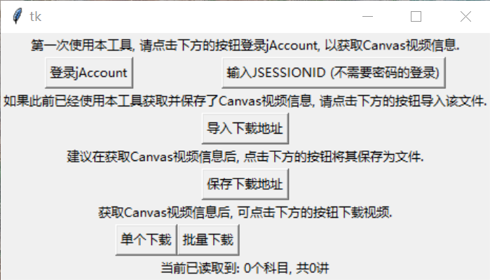

登录界面:

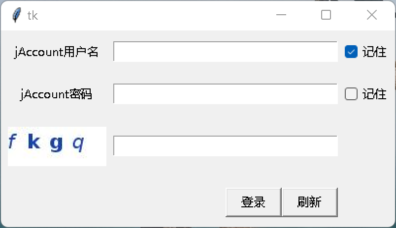

二维码登录界面:

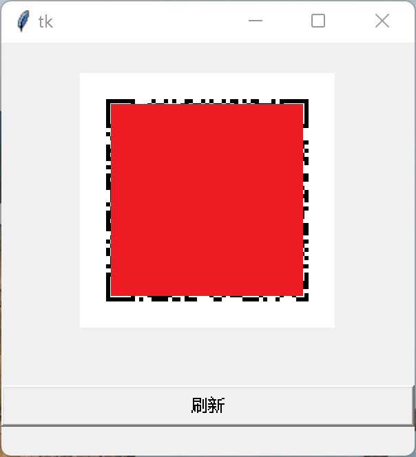

JSESSIONID登录界面:

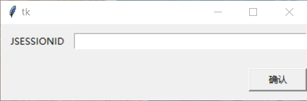

单个下载选择界面:

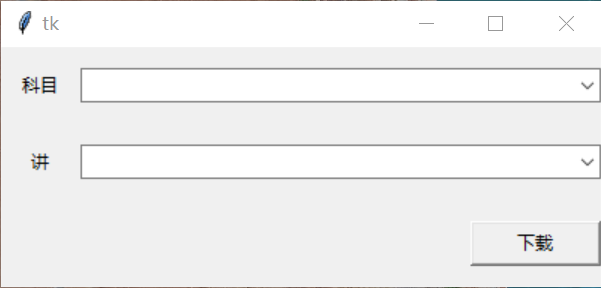

批量下载选择界面:

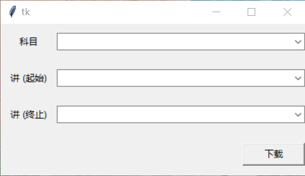

下载界面:

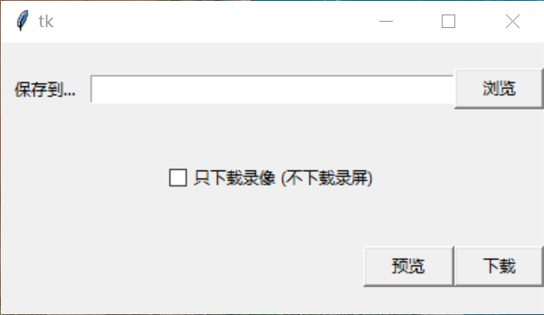

##### Linux (Ubuntu 20.04)

主界面:

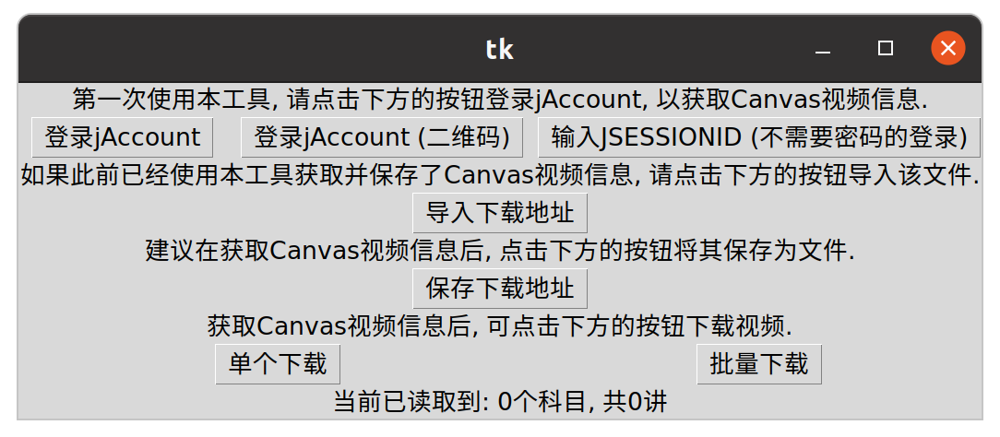

登录界面:

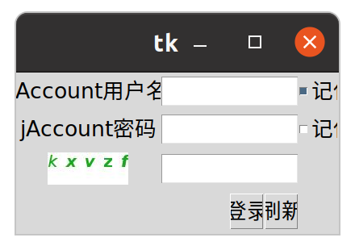

二维码登录界面:

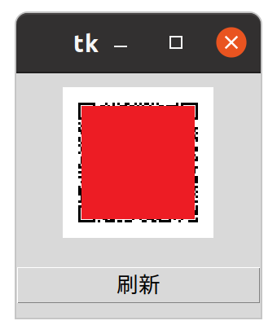

JSESSIONID登录界面:

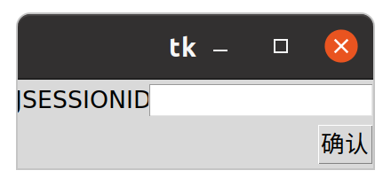

单个下载选择界面:

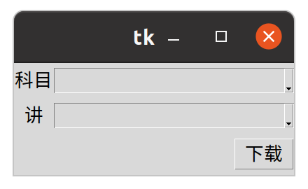

批量下载选择界面:

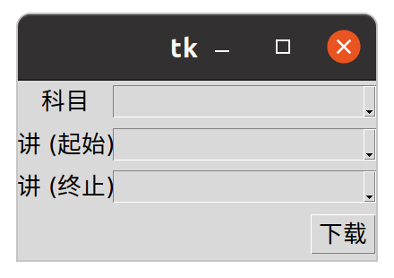

下载界面:

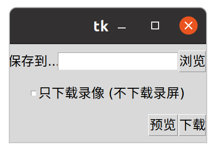

### 非Windows用户使用方法

目前只能使用源代码运行. 以Ubuntu 20.04为例. 请安装`python3`, `python3-pip`.

```sh
sudo apt install python3
sudo apt install python3-pip
```

安装`requirements.txt`中的软件包.

```sh
sudo pip3 install -r requirements.txt
```

需要安装`python3-tk`, `python3-pil.imagetk`, `aria2`.

```sh
sudo apt install python3-tk
sudo apt install python3-pil.imagetk
sudo apt install aria2
```

现在, 就可以使用:

```sh
python3 main.py
```

启动本程序了.
